好的！我来为你编写一个 InfiniteTalk 项目的设计文档。好的！我来帮你整理 **InfiniteTalk 项目的设计文档**。

---

# 📚 InfiniteTalk 项目设计文档

## 1. 项目概述

**InfiniteTalk** 是一个基于扩散模型（Diffusion Model）的无限时长对话式视频生成系统，支持：
- 🖼️ **图生视频**（Image-to-Video, I2V）
- 🎥 **视频生视频**（Video-to-Video, V2V）
- 🎤 **音频驱动**（Audio-driven）嘴型同步
- ⏱️ **流式生成**（Streaming）支持无限时长
- 👥 **多人对话**（Multi-person）

---

## 2. 核心架构

### 2.1 系统组件

```
InfiniteTalk
├── generate_infinitetalk.py    # 主入口脚本
├── wan/                         # 核心模块
│   ├── multitalk.py            # Pipeline 核心实现
│   ├── modules/                # 神经网络模块
│   │   ├── multitalk_model.py  # DiT Transformer 模型
│   │   ├── t5.py               # T5 文本编码器
│   │   ├── vae.py              # VAE 编解码器
│   │   ├── clip.py             # CLIP 视觉编码器
│   │   └── attention.py        # 注意力机制
│   ├── utils/                  # 工具函数
│   │   ├── multitalk_utils.py  # 核心工具
│   │   ├── utils.py            # 通用工具
│   │   └── segvideo.py         # 视频分段
│   └── configs.py              # 配置文件
└── src/                        # 辅助模块
    ├── audio_analysis/         # 音频处理
    │   └── wav2vec2.py         # Wav2Vec2 编码器
    └── vram_management/        # 显存管理
```

---

### 2.2 数据流图

```mermaid
graph TD
    A[输入] --> B[图像/视频]
    A --> C[音频]
    A --> D[文本提示]
    
    B --> E[CLIP 编码器]
    B --> F[VAE 编码器]
    C --> G[Wav2Vec2 编码器]
    D --> H[T5 文本编码器]
    
    E --> I[视觉特征]
    F --> J[潜在空间 Latent]
    G --> K[音频嵌入]
    H --> L[文本嵌入]
    
    I --> M[DiT Transformer]
    J --> M
    K --> M
    L --> M
    
    M --> N[去噪过程<br/>Diffusion Sampling]
    N --> O[VAE 解码器]
    O --> P[生成视频]
```



---

## 3. 核心模块详解

### 3.1 InfiniteTalkPipeline（wan/multitalk.py）

**职责**：视频生成的主控制器

**关键方法**：

#### `__init__()` - 初始化
```python
def __init__(self, config, checkpoint_dir, device_id=0, ...):
    # 1. 加载 T5 文本编码器
    self.text_encoder = T5EncoderModel(...)
    
    # 2. 加载 VAE 编解码器
    self.vae = WanVAE(...)
    
    # 3. 加载 CLIP 视觉编码器
    self.clip = CLIPModel(...)
    
    # 4. 加载 DiT Transformer 主模型
    self.model = WanModel(...)
    
    # 5. 加载 LoRA 权重（可选）
    if lora_dir:
        lora_wrapper.load_lora(lora_path)
```

#### `generate_infinitetalk()` - 生成视频
```python
def generate_infinitetalk(self, input_data, ...):
    # 1. 预处理输入
    cond_image = extract_frames(video_path)  # 提取参考帧
    audio_emb = load_audio_embedding()        # 加载音频嵌入
    
    # 2. 编码条件
    context = text_encoder(prompt)            # 文本编码
    clip_fea = clip(cond_image)              # 图像编码
    y = vae.encode(cond_image)               # VAE 编码
    
    # 3. 流式生成循环
    while not arrive_last_frame:
        # 3.1 准备噪声
        noise = torch.randn(...)
        
        # 3.2 扩散采样（去噪过程）
        for timestep in timesteps:
            # CFG（Classifier-Free Guidance）
            noise_pred_cond = model(latent, audio, text)
            noise_pred_uncond = model(latent, null_audio, null_text)
            noise_pred = uncond + scale * (cond - uncond)
            
            # 更新 latent
            latent = latent + noise_pred * dt
        
        # 3.3 解码
        video_chunk = vae.decode(latent)
        
        # 3.4 更新条件（为下一段）
        cond_frame = video_chunk[-motion_frames:]
        audio_start_idx += frame_num
    
    # 4. 拼接所有片段
    return torch.cat(video_chunks)
```

---

### 3.2 音频处理流程（generate_infinitetalk.py）

```python
# 1. 加载 Wav2Vec2 模型
wav2vec_feature_extractor, audio_encoder = custom_init(wav2vec_dir)

# 2. 预处理音频
def audio_prepare_single(audio_path):
    # 2.1 加载音频
    audio_array, sr = librosa.load(audio_path, sr=16000)
    
    # 2.2 响度归一化
    audio_array = loudness_norm(audio_array, lufs=-23)
    
    return audio_array

# 3. 提取音频嵌入
def get_embedding(speech_array, audio_encoder):
    # 3.1 特征提取
    audio_feature = wav2vec_feature_extractor(speech_array)
    
    # 3.2 编码
    embeddings = audio_encoder(audio_feature)
    
    # 3.3 堆叠隐藏状态
    audio_emb = torch.stack(embeddings.hidden_states[1:])
    
    return audio_emb
```

---

### 3.3 DiT Transformer 模型（wan/modules/multitalk_model.py）

**核心组件**：

1. **Transformer Blocks**：处理时空特征
2. **Audio Cross-Attention**：将音频特征注入到视频生成
3. **Rotary Position Embedding**：位置编码
4. **TeaCache**：加速推理（可选）

```python
class WanModel(nn.Module):
    def __init__(self, ...):
        self.blocks = nn.ModuleList([
            WanBlock(
                self_attn=...,           # 自注意力
                audio_cross_attn=...,    # 音频交叉注意力
                feedforward=...,         # FFN
            )
            for _ in range(num_layers)
        ])
    
    def forward(self, x, audio, context, ...):
        for block in self.blocks:
            # 1. 自注意力（处理视频特征）
            x = block.self_attn(x)
            
            # 2. 音频交叉注意力（融合音频）
            x = block.audio_cross_attn(x, audio)
            
            # 3. 前馈网络
            x = block.feedforward(x)
        
        return x
```

---

## 4. 关键技术

### 4.1 流式生成（Streaming Generation）

**原理**：分块生成 + 运动帧注入

```python
# 伪代码
video_chunks = []
motion_frames = None  # 初始为空

while not finished:
    # 1. 生成一个片段（81 帧）
    chunk = generate_chunk(
        motion_frames=motion_frames,  # 前一段的最后几帧
        audio_segment=audio[start:end]
    )
    
    # 2. 保存片段
    video_chunks.append(chunk)
    
    # 3. 提取运动帧（用于下一段）
    motion_frames = chunk[-9:]  # 最后 9 帧
    
    # 4. 更新音频索引
    start += 72  # 81 - 9 = 72 新帧

# 拼接
final_video = concat(video_chunks)
```

---

### 4.2 分类器自由引导（CFG）

**公式**：
```
noise_pred = noise_uncond + text_scale × (noise_text - noise_uncond) 
                          + audio_scale × (noise_audio - noise_text)
```

**代码**：
```python
# 三次前向传播
noise_cond = model(latent, audio=audio, text=text)          # 完整条件
noise_drop_audio = model(latent, audio=null, text=text)     # 无音频
noise_uncond = model(latent, audio=null, text=null)         # 完全无条件

# CFG 组合
noise_pred = noise_uncond + \
             text_guide_scale * (noise_cond - noise_drop_audio) + \
             audio_guide_scale * (noise_drop_audio - noise_uncond)
```

---

### 4.3 多人对话

**关键**：使用人脸遮罩（Mask）分离不同说话人

```python
# 1. 为每个人创建遮罩
human_mask1 = torch.zeros(H, W)
human_mask1[x1:x2, y1:y2] = 1  # 第一个人的区域

human_mask2 = torch.zeros(H, W)
human_mask2[x3:x4, y3:y4] = 1  # 第二个人的区域

# 2. 传递给模型
output = model(
    latent,
    audio=[audio1, audio2],           # 两段音频
    ref_target_masks=[mask1, mask2]   # 对应遮罩
)
```

---

### 4.4 显存优化

#### **VRAM Management**
```python
# 按需加载参数
class AutoWrappedLinear:
    def __init__(self, layer, ...):
        self.offload_device = "cpu"
        self.onload_device = "cuda"
    
    def forward(self, x):
        # 1. 加载到 GPU
        self.weight = self.weight.to("cuda")
        
        # 2. 计算
        output = F.linear(x, self.weight)
        
        # 3. 卸载到 CPU
        self.weight = self.weight.to("cpu")
        
        return output
```

#### **参数**：`--num_persistent_param_in_dit 0`
- `0`：极低显存（所有参数按需加载）
- `1-2`：保留部分参数在 GPU（更快）

---

## 5. 配置系统

### 5.1 分辨率配置（wan/configs.py）

```python
SIZE_CONFIGS = {
    "infinitetalk-480": {
        "height": 480,
        "width": 720,
        "aspect_ratios": {...}
    },
    "infinitetalk-720": {
        "height": 720,
        "width": 1280,
        "aspect_ratios": {...}
    }
}
```

### 5.2 模型配置

```python
WAN_CONFIGS = {
    "infinitetalk-14B": {
        "num_layers": 40,
        "hidden_size": 3072,
        "num_heads": 24,
        "vae_stride": [4, 8, 8],
        "patch_size": [1, 2, 2],
        ...
    }
}
```

---

## 6. 加速技术

### 6.1 FusionX LoRA
- **原理**：低秩适应（Low-Rank Adaptation）
- **效果**：8 步达到 40 步质量
- **参数**：
  ```bash
  --lora_dir FusionX_LoRA.safetensors
  --lora_scale 1.0
  --sample_steps 8
  ```

### 6.2 TeaCache
- **原理**：缓存注意力计算结果
- **参数**：
  ```bash
  --use_teacache
  --teacache_thresh 0.2
  ```

### 6.3 量化（Quantization）
- **类型**：INT8 / FP8
- **效果**：减少 50% 显存
- **参数**：
  ```bash
  --quant fp8
  --quant_dir infinitetalk_fp8.safetensors
  ```

---

## 7. 分布式训练支持

### 7.1 FSDP（Fully Sharded Data Parallel）
```bash
--t5_fsdp      # T5 模型分片
--dit_fsdp     # DiT 模型分片
```

### 7.2 Sequence Parallel（USP）
```bash
GPU_NUM=8
--ulysses_size=$GPU_NUM   # Ulysses 注意力并行
--ring_size=1             # Ring 注意力并行
```

---

## 8. 输入格式

### 8.1 单人模式
```json
{
  "prompt": "A person talking",
  "cond_video": "examples/ref_image.png",
  "cond_audio": {
    "person1": "examples/audio.wav"
  }
}
```

### 8.2 多人模式
```json
{
  "prompt": "Two people talking",
  "cond_video": "examples/ref_image.png",
  "cond_audio": {
    "person1": "examples/audio1.wav",
    "person2": "examples/audio2.wav"
  },
  "audio_type": "para",  # "para" 或 "add"
  "bbox": {
    "person1": [x1, y1, x2, y2],
    "person2": [x3, y3, x4, y4]
  }
}
```

---

## 9. 生成流程总结

```
1. 输入准备
   ├── 图像/视频 → CLIP + VAE 编码
   ├── 音频 → Wav2Vec2 编码
   └── 文本 → T5 编码

2. 初始化
   ├── 创建噪声 latent
   └── 准备时间步序列

3. 迭代去噪（Diffusion Sampling）
   ├── 前向传播（3 次 CFG）
   ├── 计算噪声预测
   ├── 更新 latent
   └── 注入运动帧

4. 解码
   └── VAE 解码 latent → 视频帧

5. 流式拼接（如果 mode=streaming）
   ├── 保存当前片段
   ├── 提取运动帧
   └── 重复步骤 3-4

6. 后处理
   ├── 色彩校正
   ├── 添加音频
   └── 保存视频
```

---

## 10. 性能参数对照表

| 参数                   | 作用         | 权衡                  |
| ---------------------- | ------------ | --------------------- |
| `sample_steps`         | 采样步数     | 质量 ↑ 速度 ↓         |
| `audio_guide_scale`    | 音频引导强度 | 嘴型准确 ↑ 自然度 ↓   |
| `text_guide_scale`     | 文本引导强度 | 提示遵循 ↑ 多样性 ↓   |
| `motion_frame`         | 运动帧数     | 连贯性 ↑ 速度 ↓       |
| `num_persistent_param` | 持久参数数量 | 速度 ↑ 显存 ↑         |
| `lora_scale`           | LoRA 强度    | 加速 ↑ 色彩偏移风险 ↑ |

---

希望这个文档能帮你理解 InfiniteTalk 的设计！需要我详细展开某个部分吗？ 🚀